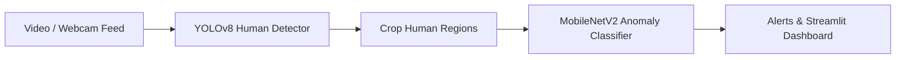

# Field Surveillance & Anomaly Detection System

An end-to-end computer vision and deep learning solution for real-time human detection and anomaly classification in surveillance environments. The system integrates **YOLOv8** for fast object detection with a fine-tuned **MobileNetV2** model for anomaly analysis, backed by an interactive **Streamlit** monitoring dashboard.

---

## Key Features

- 🎯 **Real-time Human Detection**: Leverages YOLOv8 to localize human subjects in video streams and images.
- 🚨 **Anomaly Classification**: Fine-tuned MobileNetV2 architecture to classify detected subjects for anomalous behaviors or unauthorized access.
- 📊 **Interactive Monitoring Dashboard**: Built with Streamlit for real-time visualization, metric tracking, and alert logs.
- 📹 **Flexible Inference Modes**: Supports live webcam feed, pre-recorded video files, and single frame analysis.
- 📈 **Performance Analytics**: Includes evaluation scripts to generate normalized confusion matrices and performance metrics.

---

## System Pipeline Architecture



---

## Directory Structure

```
Field project/
├── .streamlit/
│   └── config.toml                  # Streamlit server configurations
├── Complete_Project_Codebase.ipynb   # Complete project notebook & workflow
├── Final_Anomaly_Detection_System.ipynb # End-to-end anomaly detection pipeline notebook
├── dashboard_app.py                 # Interactive Streamlit monitoring application
├── full_surveillance_system.py      # Real-time integrated surveillance pipeline
├── pipeline_inference.py            # Combined YOLO + MobileNet inference script
├── webcam_inference.py              # Live webcam detection test script
├── video_inference.py               # Pre-recorded video file inference script
├── check_webcam.py                  # OpenCV webcam connectivity verification utility
├── process_dataset.py               # Dataset processing and train/val splitting script
├── process_dataset_cropped.py       # Cropped dataset generator for model training
├── prepare_yolo_data.py             # YOLO format dataset prep script
├── train_model.py                   # PyTorch MobileNetV2 training script
├── train_yolo.py                    # YOLO fine-tuning / training script
├── generate_normalized_cm.py        # Confusion matrix generation utility
├── launch_dashboard.bat             # Shortcut script to launch Streamlit dashboard
├── run_webcam.bat                   # Shortcut script to launch live webcam inference
├── model_performance_report.txt     # Performance evaluation summary
├── data.yaml                        # YOLO dataset configuration
├── requirements.txt                 # Python dependency declarations
└── README.md                        # Project documentation
```

---

## Installation & Setup

### Prerequisites

- Python 3.8+
- PyTorch 2.0+ with CUDA support (recommended for GPU acceleration)
- OpenCV

### Environment Setup

1. **Clone the Repository:**
   ```bash
   git clone https://github.com/your-username/field-surveillance-system.git
   cd field-surveillance-system
   ```

2. **Create and Activate a Virtual Environment:**
   ```bash
   # Windows
   python -m venv .venv
   .venv\Scripts\activate

   # Linux/macOS
   python3 -m venv .venv
   source .venv/bin/activate
   ```

3. **Install Dependencies:**
   ```bash
   pip install -r requirements.txt
   ```

---

## Model Weights & Datasets

> [!NOTE]
> Trained model weights (`best_model.pth`, `best_pretrained_mobilenetv2.pth`, `yolov8n.pt`) and dataset folders (`archive/`, `processed_data/`, `yolo_data/`) are excluded from the repository to keep the codebase lightweight.

To run inference locally:
1. Download or train the **YOLOv8** weights (`yolov8n.pt`) and place them in the root directory.
2. Place your trained MobileNetV2 classifier weights (`best_pretrained_mobilenetv2.pth`) in the root directory.

---

## Usage Guide

### 1. Launch Interactive Dashboard
```bash
# Using the shortcut (Windows):
launch_dashboard.bat

# Or directly via Streamlit:
streamlit run dashboard_app.py
```

### 2. Run Real-Time Webcam Surveillance
```bash
# Using the shortcut (Windows):
run_webcam.bat

# Or directly via Python:
python full_surveillance_system.py
```

### 3. Run Inference on Video Files
```bash
python video_inference.py --source path/to/video.mp4
```

### 4. Train Models
- **Train Classifier (MobileNetV2):**
  ```bash
  python train_model.py
  ```
- **Train YOLO Detector:**
  ```bash
  python train_yolo.py
  ```

---

## License & Acknowledgments

Developed as a field project for automated surveillance and anomaly detection using deep learning.
